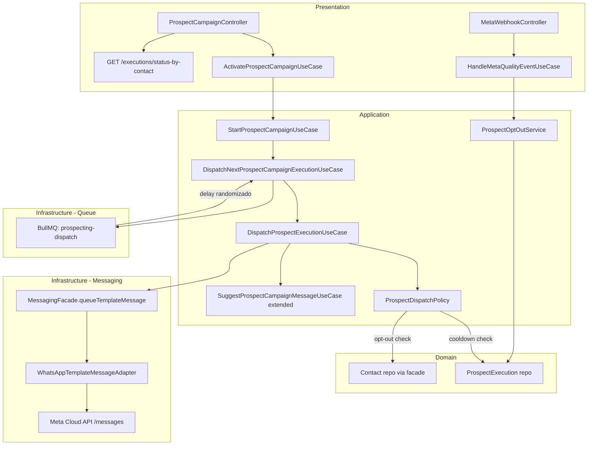

# Prospecting Enterprise Campaign Engine — Design

**Spec**: `.specs/features/prospecting-enterprise-campaign/spec.md`
**Status**: Draft

---

## Architecture Overview



---

## Code Reuse Analysis

### Existing Components to Leverage

| Component | Location | How to Use |
|---|---|---|
| `DispatchProspectExecutionUseCase` | `modules/prospecting/application/use-cases/` | Modificar para chamar `queueTemplateMessage` quando `templateName` presente |
| `ProspectDispatchPolicy` | `modules/prospecting/application/services/` | Estender com cooldown check e opt-out check |
| `SuggestProspectCampaignMessageUseCase` | `modules/prospecting/application/use-cases/` | Reutilizar lógica de IA para gerar valores de variáveis |
| `DispatchNextProspectCampaignExecutionUseCase` | `modules/prospecting/application/use-cases/` | Adicionar delay randomizado via BullMQ job options |
| `MessagingFacade` (interface) | `shared/application/facades/` | Adicionar método `queueTemplateMessage` |
| `PrismaProspectExecutionRepository` | `modules/prospecting/infrastructure/persistence/` | Adicionar query `findLastContactedAt(tenantId, contactId)` |
| `ProspectCampaign` entity | `modules/prospecting/domain/entities/` | Adicionar campos `templateName`, `templateVariableMapping`, `cooldownDays`, `minDelaySeconds`, `maxDelaySeconds`, `blockRateThreshold` |
| BullMQ prospecting queue | `prospecting.module.ts:298` | Reutilizar queue existente; adicionar job de dispatch com delay |

### Integration Points

| System | Integration Method |
|---|---|
| MessagingFacade | Novo método `queueTemplateMessage` seguindo padrão de `queueSystemMessage` |
| Meta Cloud API | Adapter HTTP no módulo messaging chamando endpoint `/messages` com `type: template` |
| Meta Webhook | Novo controller em módulo messaging ou prospecting; valida HMAC, roteia evento |
| AIModule | Reutilizar via token DI existente para geração de variáveis |
| ContactFacade | Reutilizar `getContactById` para dados de personalização; adicionar `markProspectingOptOut` |

---

## Components

### 1. MessagingFacade — `queueTemplateMessage`

- **Purpose**: Contrato para envio de mensagem template WhatsApp
- **Location**: `shared/application/facades/MessagingFacade.ts` (adicionar método)
- **Interfaces**:
  ```typescript
  queueTemplateMessage(params: {
    tenantId: string;
    contactId: string;
    channel: 'WHATSAPP';
    templateName: string;
    languageCode: string; // ex: 'pt_BR'
    components: WhatsAppTemplateComponent[];
  }): Promise<{ conversationId: string; messageId: string }>
  ```
- **Dependencies**: Implementação em MessagingModule adapter
- **Reuses**: Padrão de `queueSystemMessage` existente

---

### 2. WhatsAppTemplateMessageAdapter

- **Purpose**: Adapter que chama Meta Cloud API para envio de template message
- **Location**: `modules/messaging/infrastructure/adapters/WhatsAppTemplateMessageAdapter.ts`
- **Interfaces**:
  ```typescript
  sendTemplateMessage(params: SendTemplateMessageParams): Promise<MetaMessageResponse>
  ```
- **Payload Meta API**:
  ```json
  {
    "messaging_product": "whatsapp",
    "to": "{{phone}}",
    "type": "template",
    "template": {
      "name": "{{templateName}}",
      "language": { "code": "pt_BR" },
      "components": [
        {
          "type": "body",
          "parameters": [
            { "type": "text", "text": "{{var1}}" }
          ]
        }
      ]
    }
  }
  ```
- **Dependencies**: HTTP client existente do módulo messaging; `WHATSAPP_ACCESS_TOKEN` env var
- **Reuses**: Padrão de adapter HTTP existente no módulo messaging

---

### 3. ProspectCampaign Entity — Campos Novos

- **Purpose**: Suportar template + configuração anti-abuso
- **Location**: `modules/prospecting/domain/entities/ProspectCampaign.ts`
- **Novos campos**:
  ```typescript
  templateName?: string;           // nome do template no Meta Business Manager
  languageCode: string;            // default: 'pt_BR'
  templateVariableMapping?: Record<string, string>; // ex: {"1": "name", "2": "segment"}
  aiVariableGeneration: boolean;   // default: false
  cooldownDays: number;            // default: 30
  minDelaySeconds: number;         // default: 30
  maxDelaySeconds: number;         // default: 120
  blockRateThreshold: number;      // default: 0.05 (5%)
  ```
- **Reuses**: Estrutura de entidade existente

---

### 4. ProspectDispatchPolicy — Extensão

- **Purpose**: Validar cooldown, opt-out e tentativas antes de dispatch
- **Location**: `modules/prospecting/application/services/ProspectDispatchPolicy.ts`
- **Novas validações**:
  ```typescript
  async assertCanDispatch(tenantId, contactId, campaign): Promise<void>
  // 1. attemptCount >= 1 → throw PROSPECT_ALREADY_CONTACTED
  // 2. lastContactedAt dentro cooldownDays → throw COOLDOWN_ACTIVE
  // 3. contact.prospectingOptOut === true → throw OPT_OUT
  // 4. contact.whatsappPhone null → throw NO_WHATSAPP_PHONE
  ```
- **Dependencies**: `PrismaProspectExecutionRepository.findLastContactedAt()`, `ContactFacade.getContactById()`
- **Reuses**: Estrutura de policy existente + erros de domínio

---

### 5. DispatchProspectExecutionUseCase — Modificação

- **Purpose**: Usar template quando disponível, texto livre como fallback
- **Location**: `modules/prospecting/application/use-cases/DispatchProspectExecutionUseCase.ts`
- **Lógica**:
  ```typescript
  if (campaign.templateName) {
    const variables = await this.resolveTemplateVariables(campaign, contact);
    await messagingFacade.queueTemplateMessage({ templateName, components: variables });
  } else {
    await messagingFacade.queueSystemMessage({ text });
  }
  ```
- **Reuses**: Lógica de substituição `{{name}}` existente como fallback de variáveis

---

### 6. DispatchNextProspectCampaignExecutionUseCase — Delay Randomizado

- **Purpose**: Adicionar delay randomizado entre dispatches consecutivos
- **Location**: `modules/prospecting/application/use-cases/DispatchNextProspectCampaignExecutionUseCase.ts`
- **Lógica**:
  ```typescript
  const delay = randomBetween(campaign.minDelaySeconds, campaign.maxDelaySeconds) * 1000;
  await this.dispatchQueue.add('dispatch', { campaignId, executionId }, { delay });
  ```
- **Reuses**: BullMQ queue existente `prospecting-async-jobs`; adicionar nova queue `prospecting-dispatch`

---

### 7. HandleMetaQualityEventUseCase

- **Purpose**: Processar eventos de qualidade Meta (spam report, block)
- **Location**: `modules/prospecting/application/use-cases/HandleMetaQualityEventUseCase.ts`
- **Interfaces**:
  ```typescript
  execute(event: MetaQualityEvent): Promise<void>
  // → marcar contact.prospectingOptOut = true
  // → criar ProspectExecution com stopReason: OPT_OUT (se execução pendente existe)
  // → verificar blockRate → auto-pause campanha se threshold atingido
  ```
- **Dependencies**: `ContactFacade.markProspectingOptOut()`, `ProspectCampaignRepository`, `PauseCampaignUseCase`

---

### 8. MetaWebhookController

- **Purpose**: Receber e validar webhooks da Meta
- **Location**: `modules/prospecting/presentation/controllers/MetaWebhookController.ts`
- **Endpoints**:
  - `GET /meta/webhook` — verificação de challenge (Meta handshake)
  - `POST /meta/webhook` — receber eventos; valida assinatura HMAC-SHA256 com `X-Hub-Signature-256`
- **Reuses**: Padrão de controller existente; crypto Node.js para HMAC

---

### 9. ProspectExecutionStatusQuery

- **Purpose**: Endpoint para badge — retorna status de prospecção por contactId(s)
- **Location**: `modules/prospecting/presentation/controllers/ProspectExecutionController.ts` (adicionar endpoint)
- **Endpoint**: `GET /prospect-executions/status?contactIds=id1,id2`
- **Response**:
  ```typescript
  {
    contactId: string;
    status: 'CONTACTED' | 'RESPONDED' | 'STOPPED' | 'NONE';
    lastContactedAt?: Date;
    stopReason?: string;
    campaignName?: string;
  }[]
  ```
- **Reuses**: `PrismaProspectExecutionRepository`; adicionar query `findLatestByContactIds()`

---

## Data Models

### Prisma Schema — ProspectCampaign additions

```prisma
model ProspectCampaign {
  // campos existentes...
  templateName            String?
  languageCode            String   @default("pt_BR")
  templateVariableMapping Json?    // Record<string, string>
  aiVariableGeneration    Boolean  @default(false)
  cooldownDays            Int      @default(30)
  minDelaySeconds         Int      @default(30)
  maxDelaySeconds         Int      @default(120)
  blockRateThreshold      Float    @default(0.05)
}
```

### Prisma Schema — Contact additions (via ContactModule)

```prisma
model Contact {
  // campos existentes...
  prospectingOptOut    Boolean  @default(false)
  prospectingOptOutAt  DateTime?
}
```

### New BullMQ Queue: `prospecting-dispatch`

```typescript
// Job payload
interface ProspectDispatchJobPayload {
  tenantId: string;
  campaignId: string;
  executionId: string;
}
// Options: delay (ms), attempts: 3, backoff: exponential
```

---

## Error Handling Strategy

| Error Scenario | Handling | User Impact |
|---|---|---|
| Template não existe na Meta | `stopReason: TEMPLATE_UNAVAILABLE` + pause campanha | Tenant vê campanha pausada com razão |
| Contato sem WhatsApp phone | `stopReason: NO_WHATSAPP_PHONE` | Execução marcada STOPPED, próxima segue |
| Cooldown ativo | `stopReason: COOLDOWN_ACTIVE` | Execução pulada, contato tentado de novo após cooldown |
| HMAC inválido no webhook | 403 sem processar | Silencioso para attacker; log interno |
| Block rate > threshold | Auto-pause + alerta tenant | Tenant notificado; pode reativar |
| IA falha em gerar variável | Fallback para dados diretos do contato | Mensagem menos personalizada mas enviada |

---

## Tech Decisions

| Decision | Choice | Rationale |
|---|---|---|
| Template API vs texto livre | Template quando `templateName` presente, fallback texto livre | Backwards compatible; migração gradual |
| Delay entre envios | BullMQ job delay (não sleep) | Não bloqueia thread; resiliente a restart |
| Cooldown cross-campaign | Verificar por `contactId` independente de `campaignId` | Protege contra spam via múltiplas campanhas |
| HMAC webhook | Node.js `crypto.timingSafeEqual` | Previne timing attacks |
| Opt-out storage | Campo no Contact (ContactModule) | Reutilizável por qualquer módulo futuro |

---

## Migration Impact

1. `ProspectCampaign` — additive (campos nullable/com default) → sem breaking change
2. `Contact.prospectingOptOut` — additive → sem breaking change
3. Nova queue BullMQ — register no `prospecting.module.ts`
4. Novo endpoint GET webhook — precisa ser público (sem auth JWT) mas com HMAC
