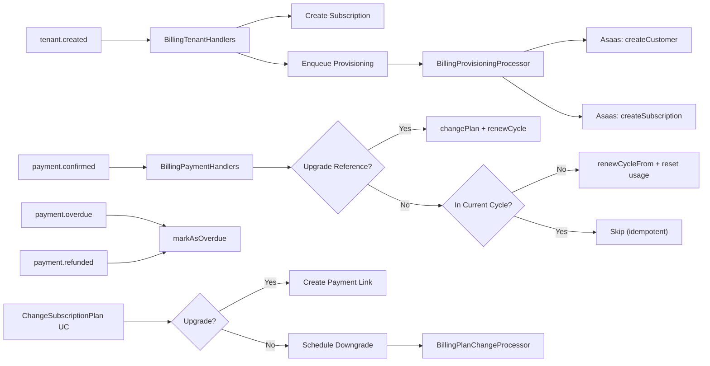

# Análise e Bateria de Testes — Módulo Billing

Análise completa do domínio, cobertura atual e proposta de testes unitários e E2E para blindar o módulo `billing`.

---

## Resumo do Domínio

| Camada | Artefatos |
|---|---|
| **Entities** | `Subscription` (Aggregate Root), `UsageRecord` |
| **Value Objects** | `Quotas` (PlanType: ESSENCIAL \| PROFISSIONAL \| ESCALA) |
| **Integration Events** | `SubscriptionProvisioned`, `SubscriptionActivated`, `SubscriptionOverdue`, `CycleRenewed`, `QuotaExceeded`, `QuotaWarning` (6 eventos) |
| **Repository Interface** | `IBillingRepository` (7 métodos: findSubscription, saveSubscription, listPlans, findPlanByCode, findLatestUsage, getUsage, saveUsage, saveAuditLog) |
| **Use Cases** | 6 use cases: `CheckQuota`, `RecordUsage`, `GetUsage`, `ListBillingPlans`, `ChangeSubscriptionPlan`, `CancelSubscription` |
| **Handlers** | `BillingTenantHandlers` (tenant.created, tenant.plan-changed), `BillingPaymentHandlers` (payment.confirmed, payment.overdue, payment.refunded), `BillingUsageHandlers` (messaging.message-sent, ai.response-generated) |
| **Processors (BullMQ)** | `BillingProvisioningProcessor` (provision-tenant), `BillingPlanChangeProcessor` (apply-scheduled-plan-change) |
| **Controllers** | `SubscriptionController` (3 endpoints), `UsageController` (1 endpoint), `PublicBillingController` (1 endpoint) |
| **Persistence** | `PrismaBillingRepository`, `BillingMapper` |

---

## Arquitetura de Fluxos Críticos



---

## Cobertura Atual (15 arquivos de teste)

### ✅ Testes Unitários de Domínio (2)
| Arquivo | Cenários | Status |
|---|---|---|
| `Subscription.spec.ts` | 5 cenários (create, activate, overdue, renewCycle, changePlan) | ✅ Bom |
| `UsageRecord.spec.ts` | 4 cenários (create zeroed, recordMessage, recordTokens, recordContact) | ✅ Bom |

### ✅ Testes Unitários de Use Cases (5)
| Arquivo | Cenários | Status |
|---|---|---|
| `CheckQuotaUseCase.spec.ts` | 4 cenários (no subscription, overdue, under quota, over quota) | ✅ Bom |
| `RecordUsageUseCase.spec.ts` | 2 cenários (create new, update existing) | ✅ Básico |
| `GetUsageUseCase.spec.ts` | 2 cenários (no subscription, combined output) | ✅ Básico |
| `ListBillingPlansUseCase.spec.ts` | 1 cenário (return catalog) | ✅ Mínimo |
| `ChangeSubscriptionPlanUseCase.spec.ts` | 3 cenários (upgrade checkout, downgrade ESSENCIAL, downgrade between paid) | ✅ Bom |
| `CancelSubscriptionUseCase.spec.ts` | 2 cenários (remote + local cancel) | ✅ Bom |

### ✅ Testes de Handlers/Processors (2)
| Arquivo | Cenários | Status |
|---|---|---|
| `BillingEventHandlers.spec.ts` | 9 cenários (tenant.created, plan-changed, payment.confirmed, overdue, refunded) | ✅ Bom — mais completo |
| `BillingProvisioningProcessor.spec.ts` | 5 cenários (ESSENCIAL, full provision, skip existing, partial payload, max attempts fail) | ✅ Bom |
| `BillingPlanChangeProcessor.spec.ts` | 1 cenário (apply downgrade) | ✅ Mínimo |

### ✅ Testes de Integração (1)
| Arquivo | Cenários | Status |
|---|---|---|
| `PrismaBillingRepository.integration.spec.ts` | 2 cenários (subscription CRUD, usage CRUD) | ✅ Básico |

### ✅ Testes E2E (2)
| Arquivo | Cenários | Status |
|---|---|---|
| `billing.e2e-spec.ts` | 3 cenários (quota check, cycle renewal, BullMQ provisioning) | ✅ Bom |
| `usage-controller.e2e-spec.ts` | 5 cenários (usage, plans, 401, cross-tenant, no subscription) | ✅ Bom |

---

## Lacunas Identificadas (Gaps)

### 🟡 Domínio — Cobertura boa mas incompleta

> [!NOTE]
> Diferente do módulo Tenant, o Billing já tem testes de entidade. Porém faltam cenários de edge case e o value object `Quotas` não tem teste isolado.

**Subscription — gaps:**
- `create()` com plan PROFISSIONAL/ESCALA deve iniciar com status `PENDING` (não testado)
- `cancel()` method não testado
- `markAsProvisioningFailed()` não testado isoladamente
- `updateStatus()` generic não testado
- `updateAsaasInfo()` / `clearAsaasSubscription()` / `updateAsaasCustomer()` não testados
- `schedulePlanChange()` + `clearScheduledPlan()` não testados isoladamente
- `recordQuotaAlert()` não testado
- `reconstitute()` não testado
- `isActive()` com billing cycle expirado não testado (data no futuro vs passado)

**UsageRecord — gaps:**
- `reconstitute()` não testado
- `recordTokens(0)` edge case
- `updatedAt` deve ser atualizado em cada record*
- `periodStart` / `periodEnd` getters

**Quotas — totalmente sem teste:**
- `create('ESSENCIAL')` quotas corretas (2000, 500k, 500)
- `create('PROFISSIONAL')` quotas corretas (10000, 2M, 5000)
- `create('ESCALA')` quotas corretas (100000, 10M, 50000)
- `reconstitute()` custom values
- Default fallback (passes unknown plan)

### 🟡 Use Cases — Gaps de edge cases

**CheckQuotaUseCase:**
- Quota warning a 80% + publish de `BillingQuotaWarningIntegrationEvent` — não testado (mock de eventBus ausente no test atual!)
- Quota exceeded + publish de `BillingQuotaExceededIntegrationEvent` — não testado
- `lastQuotaAlertAt` debounce de 24h — não testado
- AI_TOKEN e CONTACT types — não testados (só MESSAGE)

**RecordUsageUseCase:**
- CONTACT type — não testado
- Subscription inexistente deve lançar `EntityNotFoundException` — não testado

**GetUsageUseCase:**
- `scheduledPlan` no output — não testado
- Usage null (retornar zeros) — não testado

**ListBillingPlansUseCase:**
- Retorno vazio — não testado

**ChangeSubscriptionPlanUseCase:**
- NO_CHANGE mode (same plan) — não testado
- Subscription inexistente — não testado
- Plan inexistente (BillingPlan not found) — não testado
- Upgrade com customerId já existente (skip createCustomer) — não testado
- Tenant/owner inexistente no ensureCustomer — não testado

**CancelSubscriptionUseCase:**
- Subscription inexistente deve lançar — não testado
- Tenant que já está em ESSENCIAL não deve chamar tenantRepository.save — não testado

### 🟡 Handlers — Gaps

**BillingPaymentHandlers:**
- `parseBillingUpgradeReference()` com input inválido/não-string/regex mismatch — lógica interna não testada diretamente
- `syncRecurringBillingAfterUpgrade()` com asaasSubscriptionId existente (update path) — não testado
- `syncRecurringBillingAfterUpgrade()` sem customerId (enfileira provisioning) — não testado
- `syncRecurringBillingAfterUpgrade()` sem plan definition (retorna vazio) — não testado
- Payment overdue quando subscription JÁ está OVERDUE (deve ignorar) — não testado
- Audit log records — não verificados nos testes existentes

**BillingUsageHandlers:**
- Totalmente sem teste unitário isolado

**BillingTenantHandlers:**
- Audit log records — não verificados nos testes existentes
- Subscription activated event para ESSENCIAL — parcialmente testado
- Existing subscription com customer mas sem subscription para paid (deve enfileirar) — edge case

### 🟡 BillingPlanChangeProcessor — Cobertura mínima
- Subscription inexistente (deve retornar sem ação) — não testado
- `scheduledPlan` diferente do `targetPlan` no job (deve retornar sem ação) — não testado

### 🟡 E2E — Gaps
- Subscription controller: `PATCH /plan` (change plan) — não testado via HTTP
- Subscription controller: `POST /cancel` — não testado via HTTP
- PublicBillingController: `GET /public/billing/plans` — não testado via HTTP
- Cross-tenant access em subscription endpoints — não testado
- DTO validation (targetPlan inválido) — não testado

### 🟢 Integração (PrismaBillingRepository) — Gaps menores
- `listPlans()` — não testado
- `findPlanByCode()` — não testado
- `saveAuditLog()` — não testado
- `findLatestUsage()` com múltiplos períodos — edge case

---

## Proposta de Bateria de Testes

### FASE 1 — Testes Unitários de Domínio (Priority: 🔴 CRITICAL)

##### `Quotas.spec.ts` (NEW)
- `[NEW]` `create('ESSENCIAL')` → messages: 2000, aiTokens: 500000, contacts: 500
- `[NEW]` `create('PROFISSIONAL')` → messages: 10000, aiTokens: 2000000, contacts: 5000
- `[NEW]` `create('ESCALA')` → messages: 100000, aiTokens: 10000000, contacts: 50000
- `[NEW]` `reconstitute()` → deve reconstruir com valores customizados
- `[NEW]` Default fallback → plano desconhecido deve usar ESSENCIAL

##### `Subscription.spec.ts` (APROFUNDAR — adicionar ao existente)
- `[NEW]` `create()` com PROFISSIONAL deve iniciar com status PENDING
- `[NEW]` `create()` com ESCALA deve iniciar com status PENDING
- `[NEW]` `cancel()` deve mudar status para CANCELED
- `[NEW]` `markAsProvisioningFailed()` deve mudar status para PROVISIONING_FAILED
- `[NEW]` `updateStatus()` deve aceitar qualquer string de status
- `[NEW]` `updateAsaasInfo()` deve setar customerId e subscriptionId
- `[NEW]` `clearAsaasSubscription()` deve limpar subscriptionId mantendo customerId
- `[NEW]` `updateAsaasCustomer()` deve setar apenas customerId
- `[NEW]` `schedulePlanChange()` deve setar scheduledPlan
- `[NEW]` `clearScheduledPlan()` deve limpar scheduledPlan
- `[NEW]` `recordQuotaAlert()` deve registrar lastQuotaAlertAt
- `[NEW]` `recordQuotaAlert()` sem argumento deve usar Date.now()
- `[NEW]` `reconstitute()` deve reconstruir sem efeitos colaterais
- `[NEW]` `isActive()` deve retornar false quando billingCycleEnd está no passado
- `[NEW]` `isActive()` deve retornar false quando status não é ACTIVE

##### `UsageRecord.spec.ts` (APROFUNDAR — adicionar ao existente)
- `[NEW]` `reconstitute()` deve reconstruir com valores fornecidos
- `[NEW]` `recordTokens(0)` deve manter aiTokensUsed inalterado
- `[NEW]` Cada método record* deve atualizar `updatedAt`
- `[NEW]` `periodStart` e `periodEnd` getters devem retornar datas corretas
- `[NEW]` `tenantId` getter deve retornar TenantId correto

---

### FASE 2 — Testes Unitários de Use Cases (Priority: 🟡 HIGH)

##### `CheckQuotaUseCase.spec.ts` (APROFUNDAR)
- `[NEW]` Deve publicar `BillingQuotaExceededIntegrationEvent` quando quota excedida
- `[NEW]` Deve salvar audit log QUOTA_EXCEEDED quando quota excedida
- `[NEW]` Deve publicar `BillingQuotaWarningIntegrationEvent` quando uso >= 80%
- `[NEW]` Deve salvars audit log QUOTA_WARNING_80 quando uso >= 80%
- `[NEW]` NÃO deve publicar warning quando `lastQuotaAlertAt` está dentro de 24h
- `[NEW]` Deve atualizar subscription com `recordQuotaAlert()` ao publicar warning
- `[NEW]` Deve verificar quota de AI_TOKEN corretamente
- `[NEW]` Deve verificar quota de CONTACT corretamente
- `[NEW]` Deve retornar used=0 quando usage é null

##### `RecordUsageUseCase.spec.ts` (APROFUNDAR)
- `[NEW]` Deve registrar CONTACT corretamente
- `[NEW]` Deve lançar `EntityNotFoundException` quando subscription não existe
- `[NEW]` Deve usar billingCycleStart/End da subscription para criar novo UsageRecord

##### `GetUsageUseCase.spec.ts` (APROFUNDAR)
- `[NEW]` Deve retornar `scheduledPlan` quando presente
- `[NEW]` Deve retornar zeros quando usage é null
- `[NEW]` Deve usar billingCycleStart/End da subscription como fallback de currentPeriod

##### `ListBillingPlansUseCase.spec.ts` (APROFUNDAR)
- `[NEW]` Deve retornar array vazio quando nenhum plano cadastrado

##### `ChangeSubscriptionPlanUseCase.spec.ts` (APROFUNDAR)
- `[NEW]` Deve retornar NO_CHANGE quando targetPlan === currentPlan
- `[NEW]` Deve lançar `EntityNotFoundException` quando subscription não existe
- `[NEW]` Deve lançar `EntityNotFoundException` quando plan não existe no catálogo (upgrade)
- `[NEW]` Deve pular createCustomer quando subscription já tem asaasCustomerId (upgrade)
- `[NEW]` Deve lançar `EntityNotFoundException` quando tenant/owner não existe no ensureCustomer

##### `CancelSubscriptionUseCase.spec.ts` (APROFUNDAR)
- `[NEW]` Deve lançar `EntityNotFoundException` quando subscription não existe
- `[NEW]` Deve pular `tenantRepository.save()` quando tenant já está em ESSENCIAL
- `[NEW]` Deve pular `tenantRepository.save()` quando tenant não é encontrado

---

### FASE 3 — Testes de Handlers/Processors (Priority: 🟡 HIGH)

##### `BillingUsageHandlers.spec.ts` (NEW)
- `[NEW]` Deve se registrar em `messaging.message-sent` e chamar RecordUsageUseCase com MESSAGE
- `[NEW]` Deve se registrar em `ai.response-generated` e chamar RecordUsageUseCase com AI_TOKEN + amount
- `[NEW]` Deve propagar tokensUsed como amount

##### `BillingEventHandlers.spec.ts` (APROFUNDAR — renomear para alinhar com handlers reais)
- `[NEW]` Deve salvar audit log SUBSCRIPTION_CREATED no tenant.created
- `[NEW]` Deve salvar audit log PLAN_CHANGED no tenant.plan-changed
- `[NEW]` Deve salvar audit log SUBSCRIPTION_OVERDUE no payment.overdue
- `[NEW]` Deve salvar audit log SUBSCRIPTION_OVERDUE no payment.refunded
- `[NEW]` payment.overdue quando subscription JÁ está OVERDUE deve ignorar
- `[NEW]` payment.refunded quando subscription JÁ está OVERDUE deve ignorar
- `[NEW]` payment.confirmed com upgrade reference + asaasSubscriptionId existente deve chamar updateSubscription
- `[NEW]` payment.confirmed com upgrade reference sem customerId deve enfileirar provisioning
- `[NEW]` payment.confirmed com upgrade reference sem plan definition deve retornar {}

##### `BillingPlanChangeProcessor.spec.ts` (APROFUNDAR)
- `[NEW]` Deve retornar sem ação quando subscription não existe
- `[NEW]` Deve retornar sem ação quando scheduledPlan não corresponde ao targetPlan
- `[NEW]` Deve publicar BillingSubscriptionActivatedIntegrationEvent após apply
- `[NEW]` Deve criar novo UsageRecord zerado após apply

##### `BillingProvisioningProcessor.spec.ts` (APROFUNDAR)
- `[NEW]` Deve lançar erro quando subscription não existe
- `[NEW]` Deve publicar `BillingSubscriptionProvisionedIntegrationEvent` após provisioning completo
- `[NEW]` NÃO deve setar PROVISIONING_FAILED em tentativas intermediárias (attemptsMade < attempts-1)

---

### FASE 4 — Testes E2E (Priority: 🟢 MEDIUM)

##### `subscription-controller.e2e-spec.ts` (NEW)
- `[NEW]` `PATCH /tenants/:id/subscription/plan` — deve requerer autenticação (401)
- `[NEW]` `PATCH /tenants/:id/subscription/plan` — deve rejeitar targetPlan inválido (400)
- `[NEW]` `PATCH /tenants/:id/subscription/plan` — deve retornar NO_CHANGE para mesmo plano
- `[NEW]` `PATCH /tenants/:id/subscription/plan` — deve retornar CHECKOUT_REQUIRED para upgrade
- `[NEW]` `POST /tenants/:id/subscription/cancel` — deve requerer autenticação (401)
- `[NEW]` `POST /tenants/:id/subscription/cancel` — deve cancelar e downgradar para ESSENCIAL
- `[NEW]` Cross-tenant access deve retornar 401

##### `public-billing-controller.e2e-spec.ts` (NEW)
- `[NEW]` `GET /public/billing/plans` — deve retornar catálogo público sem autenticação
- `[NEW]` Deve retornar todos os planos ativos com preços corretos
- `[NEW]` Cada plano deve ter features como array de strings

##### `billing-quota-warning.e2e-spec.ts` (NEW — cenário cross-module)
- `[NEW]` Deve publicar evento de warning quando usage atinge 80%
- `[NEW]` Deve bloquear quando usage atinge 100%
- `[NEW]` Deve resetar contadores após renovação de ciclo

---

## Contagem Total Proposta

| Tipo | Existentes | Novos | Total |
|---|---|---|---|
| **Unit — Value Objects (Quotas)** | 0 | ~5 | 5 |
| **Unit — Entities (Subscription + UsageRecord)** | 9 | ~20 | 29 |
| **Unit — Use Cases** | 14 | ~22 | 36 |
| **Unit — Handlers/Processors** | 15 | ~18 | 33 |
| **Integration (Prisma)** | 2 | ~4 | 6 |
| **E2E (Controller)** | 8 | ~13 | 21 |
| **TOTAL** | **48** | **~82** | **~130** |

---

## Comparação com Módulo Tenant

| Aspecto | Tenant | Billing |
|---|---|---|
| **Cobertura base** | 🔴 Zero testes de domínio | 🟡 Domínio parcial |
| **Use Cases testados** | 12/20 (60%) | 6/6 (100% basic) |
| **Handlers testados** | 0/2 (0%) | 2/3 (66%) |
| **Processors** | N/A | 2/2 (100% basic) |
| **E2E** | 5 arquivos | 2 arquivos |
| **Gaps prioritários** | Domínio inteiro | Edge cases + quota events |
| **Testes novos propostos** | ~167 | ~82 |

> [!NOTE]
> O módulo Billing está em melhor forma que o Tenant. A base está sólida. O foco aqui são **edge cases de lógica financeira** (quota warnings/exceeded, debounce de alertas, idempotência de renovação, sync de billing após upgrade) que podem causar impacto financeiro direto se regredirem.

---

## User Review Required

> [!IMPORTANT]
> **CheckQuotaUseCase** — O teste existente não injeta `eventBus` como mock. Isso faz com que cenários de quota warning/exceeded não sejam testáveis no estado atual. O fix é adicionar eventBus ao mock setup. Confirma esse ajuste?

> [!IMPORTANT]
> **BillingEventHandlers.spec.ts** — O nome do arquivo de teste referência `BillingEventHandlers` mas o código real está separado em 3 handlers (`BillingTenantHandlers`, `BillingPaymentHandlers`, `BillingUsageHandlers`). O teste existente monta tudo junto. Devemos manter assim ou espelhar a separação real?

> [!IMPORTANT]
> **E2E com Asaas real** — O teste `billing.e2e-spec.ts` cenário 3 se conecta ao Asaas Sandbox real e aguarda até 25s. Devemos manter essa abordagem ou criar override com mock do PaymentGateway para os novos testes?

## Verification Plan

### Automated Tests
```bash
# Rodar todos os testes unitários do módulo billing
npx jest --testPathPattern="src/modules/billing/__tests__" --verbose

# Rodar apenas testes de domínio
npx jest --testPathPattern="src/modules/billing/__tests__/(Subscription|UsageRecord|Quotas).spec.ts"

# Rodar E2E
npx jest --testPathPattern="src/modules/billing/__tests__/.*e2e-spec" --runInBand
```

### Manual Verification
- Verificar que nenhum teste existente quebrou
- Validar cenários de quota (80% warning, 100% block) com dados reais
- Confirmar que audit logs são registrados corretamente em cada operação
